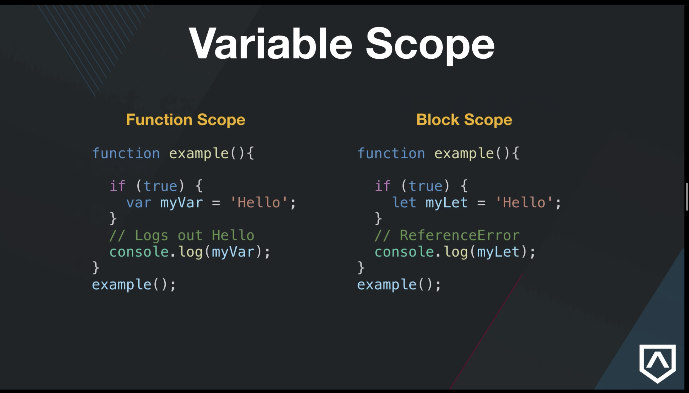

# JavaScript

## Language

The complete JavaScript implementation is made up of three distinct parts:

-   The Core (based on ECMAScript specs)
-   The Document Object Model (DOM)
-   The Browser Object Model (BOM)

## ECMAScript

ECMA-262 describes it like this:

```
ECMAScript can provide core scripting capabilities for a variety of host environments, and therefore the core scripting language is specified... apart from any particular host environment.
```

A Web browser is considered a host environment for ECMAScript, but it is not the only host environment

Apart from DOM and BOM, each browser has its own implementation of the ECMAScript interface

## Document Object Model (DOM)

- DOM is an object representation of all elements on a web page 

- DOM acts as a bridge between the content and the browser

- DOM is a tree like structure, representing the content, style, structure 

- DOM is a language neutral API

- 

The DOM maps out an entire page as a document composed of a hierarchy of nodes like a tree structure and using the DOMAPI nodes can be removed, added, and replaced.

### DOM level 1

Consisted of two modules: the DOM Core, which provided a way to map the structure of an XML-based document to allow for easy access to and manipulation of any part of a document, and the DOM HTML, which extended the DOM Core by adding HTML-specific objects and methods.

### DOM Level 2

Introduced several new modules of the DOM to deal with new types of interfaces:

-   DOM Views — describes interfaces to keep track of the various views of a document (that is, the document before CSS styling and the document after CSS styling)
-   DOM Events — describes interfaces for events
-   DOM Style — describes interfaces to deal with CSS-based styles
-   DOM Traversal and Range — describes interfaces to traverse and manipulate a document tree

### DOM Level 3

Further extends the DOM with the introduction of methods to load and save documents in a uniform way (contained in a new module called DOM Load and Save) as well as methods to validate a document (DOM Validation). In Level 3, the DOM Core is extended to support all of XML 1.0, including XML Infoset, XPath, and XML Base.

Note that the DOM is not JavaScript-specific, and indeed has been implemented in numerous other languages. For Web browsers, however, the DOM has been implemented using ECMAScript and now makes up a large part of the JavaScript language.

Other DOMs

-   Scalable Vector Graphics (SVG)
-   Mathematical Markup Language (MathML)
-   Synchronized Multimedia Integration Language (SMIL)

## Browser Object Model (BOM)

Browsers feature a Browser Object Model (BOM) that allows access and manipulation of the browser window. Using the BOM, developers can move the window, change text in the status bar, and perform other actions that do not directly relate to the page content.

Because no standards exist for the BOM, each browser has its own implementation.

## Useful About JavaScript 

- JavaScript uses a two-pass compiler when executing lines of code
  - meaning anytime we run JS in the browser, the browser will take two passes over our code
    - first pass builds up references to all of our code, declaring variables, functions, etc.
    - second pass applies values to the references that were found in the first pass, thus actually running the code

## Variables in JavaScript

### var
- function scoped, meaning the variable is only available inside of the function they are created in, unless the variable is declared globally.
- hoisted
- can be reassigned or overridden i.e redefined or updated

- Example of variable scope


### let
- block scoped
- not hoisted
- can be reassigned, but NOT overridden

### const
- block scoped
- not hoisted
- immutable, cannot be reassigned or overridden
- the most strict of all variable keywords in JS, meaning it has the most rules applied 

### A Comparison of Variables


## Helpful Variable Info

- A great example of what a block is in JavaScript
```
function tester() {
  console.log('Hello from tester function');
}
// anything inside of curly brackets { } is a block
```
- Any time you see curly brackets { }, that's a block. 
  - Functions are also blocks
  - let and const are still going to be scoped to a function
  - when variables are declared inside of functions or other elements, they will be scoped to the closest set of curly brackets { }

### Lambda School Rule of Thumb
- When defining/declaring variables, use const until you can't, then use let

## Functions in JavaScript

- We have <strong>function declarations</strong>, <strong>function expressions</strong>, <strong>arrow functions</strong>
- Invoke a function means to call the function
- When we invoke a function, we often pass in values as well.
  - these values are known as arguments
  - the function receives the arguments as parameters, in the order they were called
- this is worth repeating, <strong>arguments are values that are passed into a function, the function receives the arguments as parameters</strong>
- Functions create their own scope
  - 2 types of scope in JavaScript
    - Global
    - Local
- Functions are simply a set of instructions to complete a task
- Functions are a Type in JS, just like bolean, number, string, etc

### The return statement

- When you see a return statement, inside of a block of code within a function, <strong>anything written after a return statement will not execute</strong>
- This is because the return statement terminates the function after running the line of statements within it


## Function Declaration

- Function declarations are made up of several syntactical parts
  - the <strong>function</strong> keyword
  - the <strong>name</strong> of the function
  - optional parameters
  - the <strong>statements</strong> inside of the block of code { }

- example of a simple function declaration below

``` 
function add(a, b) {
  return a + b;
}

// invoke function add
console.log(add(5, 8));

// add is the function name, (a, b) are the parameters, (5, 8) are the arguments
``` 

### Function Declaration Hoisting

- Remember how JavaScript utilizes a two-pass compiler? Function declarations are defined in the first pass.
- Both variable and function declarations are hoisted to the top of the execution order, i.e. added to the top upon code execution
  - The concept of putting a variable/function higher in the execution order for later use is known as <strong>hoisting</strong>
  - variables/functions can be called before they are declared
  
## Function Expression

- Function expressions have unique differences when compared against function declarations. 
  - A variable is used to store the function for later use
    ``` 
    let testFunction = function(testParam) { 
      console.log('hi from testFunction'); 
    } 
    ```
  - Anonymous functions are used. Notice in the above code block how the function isn't actually named, meaning it is an anonymous function
    - Because we are using a named variable, we don't need to name our function. 
  - Function expressions are not hoisted. 
    - they can only be invoked after a definition has been placed in the execution order, i.e. the function will only run after invocation
  - Why use a function expression over a function declaration?
    - more control over code
    - since a function expression can't be hoisted, we can tell it <strong>when</strong> to do it's job easier
    - can place functions within functions easier without having to name them

## Arrow Functions

- Arrow functions are fancy looking function expressions, with a major feature removed, the <strong>this</strong> keyword

- basic arrow function expression syntax
```
const add = (a, b) => a + b;
const add = (a, b) => {
  return a + b;
}
// both are valid, arrow functions allow for more streamlined code
// be careful with how slim(streamlined) you get, readability is always important
```

### When not to use arrow functions

- Event handlers (unless the event handler is inside a class constructor)
- Object methods
- Prototype methods

## Closure in JavaScript

- Big part of JavaScript language, look at closure like <strong><i>"What data do I currently have access to in my program?"</i></strong>
- <strong>Closure simplified</strong> - a function enclosed in another function
- <strong>"Technical" closure</strong> - the combination of aa function, and the lexical environment within which that function was declared
  - lexical = surrounding state
- Inner functions have access to outer functions
- In JS, closure is created every time a function is created
  - the variables or functions declared within that function have the ability to <strong>reach outwards</strong> for context, but <strong>never inwards</strong> - see example below
- In JS, all functions are also closures
- example of closure in JS
```
const foo = 'bar';

function returnFoo() {
  let testingClosure = 'hi from inside returnFoo';
  return foo;
}

console.log(returnFoo());
// the code inside of returnFoo has access to the outer scope, returnFoo is reaching outside of it's own scope to find a variable named foo, since foo does not exist within returnFoo's scope 

console.log(testingClosure);
// will log 'testingClosure is not defined'
// remember, we can reach outwards for context, never inwards
```

- <strong>Simply put,</strong> if a function can't find a variable within it's own scope, the function will look outside of it's scope to find the variable
- this is what closure is all about

## Callback Functions in JavaScript

### What is a Callback Function?

- <strong>Simply put:</strong> Callback functions are just functions passed into other functions as arguments. A callback is a function that is to be executed, after another function has finished executing. Hence the name 'callback'

- <strong>Complexly put:</strong> In JavaScript, functions are objects. Functions can take other functions as arguments, and can be returned by other functions. 
  - Functions that do this are called <strong>Higher-Order functions</strong>
- Any function that is passed as an argument is called a <strong>callback function</strong>
- From <strong>MDN:</strong> A callback function is a function passed into another function as an argument, which is then invoked inside the outer function to complete some kind of routine or action.

### About Callback Functions

- callbacks are a way to make sure certain code doesn't execute, until other code has finished executing.
- example of a callback function from MDN
```
function greeting(name) {
  alert('Hello ' + name)
}

function processUserInput(callback) {
  let name = prompt('Please enter your name');
  callback(name);
}

processUserInput(greeting);

// a bit confusing at first
// the above example is a synchronous callback, because it is executed immediately
```

## 'this' in JavaScript

- used in many languages
- points to an object
- gives you the object's context
  - you can reference an object without using the object's name
- when using <strong>this</strong>, understand <strong>where</strong> a function is called
  - if you know a functions context, that will help point to <strong>this</strong>

### Four principals 

#### 1. Window/Global Object Binding
- When in global scope, <strong>this</strong> will be the window/console object

#### 2. Implicit Binding
- most common use of <strong>this</strong>
- when a preceding dot calls a function, the object before the dot is <strong>this</strong>

#### 3. Explicit Binding
- when using JavaScript's <strong>.call()</strong> or <strong>.apply()</strong> method, <strong>this</strong> is explicitly defined.

#### 4. New Binding
- when using a constructor function, <strong>this</strong> refers to the specific instance of the object, that is created and returned by the constructor function


## Prototypes in Javascript

- One of the most used under the hood features of the JavaScript language

- foundational to OOP (object oriented programming) in JS

- the mechanism by which all JS objects inherit from one another

- A <strong>prototype</strong> is an object, used by other objects, to hold values that can be passed down to other objects
  - When an object gets a request for a property, if the object does not have the requested property, its prototype will be searched for the property. Then the prototype's prototype will be searched, and so on.

- All objects in JS have a prototype property by default
  - this property is used as an object 
    - to attach methods & other properties, to other child functions/objects

- To create an object with a specific prototype, use <strong>Object.create</strong>
  - when using classes in JS, this link is given to us

- <strong>Object.prototype</strong>, the mechanism by which all objects can inherit from one another

- <strong>Object.getPrototypeOf</strong> returns the prototype of an object

- Functions derive from <strong>Function.prototype</strong>

- Arrays derive from <strong>Array.prototype</strong>

- To add a method to a constructor function
  - go through the prototype
  ```
  Car.prototype.reFuel = function() {}
  // adds reFuel method to the Car constructor function
  ```


## Classes in JavaScript

- Classes in JS are just special functions, utilizing constructors and prototypes under the hood

- Classes will return objects

- <strong>Class Declaration</strong>
  - way to define a class
  - Not hoisted - must first declare the class before accessing it
  ```
  class Rectangle {
    constructor(height, width) {
      this.height = height;
      this.width = width;
    }
  }
  // height and width are attributes we want to store on our created object
  ```

#### Create an Object from a Class

```
const newRect = new Rectangle(400, 500);
```

- <strong>Class Expression</strong>
  - another way to define a class
  - can be named or unnamed

- The <strong>body</strong> of a class is the part inside of the curly brackets
  - this is where you define the constructor method, other methods, etc.

- Any properties needed for the class will be done through the <strong>constructor()</strong> method

#### Constructor Method

- special method for creating & initializing an object with a class

- can have only one constructor per class

- uses <strong>super()</strong> to call the constructor of the super class

- when a constructor method is present, you will build your object's properties inside of the constructor() body using <strong>this</strong>
  - reference Class Declaration example

- the object our class returns will have attributes assigned to it from the constructor()

#### Inheritance with Classes

- <strong>extends</strong> = keyword used in class declarations/expressions to create a class, that is a child of another class
  - <strong>extends</strong> allows the child to inherit all properties from the parent
  - if you are using <strong>extends</strong>, you have to call <strong>super()</strong> in the constructor method to pass new attributes back up to the parent object's constructor
  - <strong>extends</strong> takes the place of the .call() method
  - look for <strong>extends</strong> to find sub-classes

- <strong>super</strong> = keyword used to access & call functions on an object's parent
  - takes place of Object.create()
  - binds our object's prototypes together
